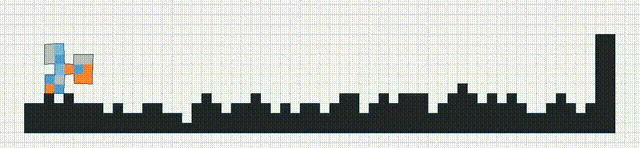
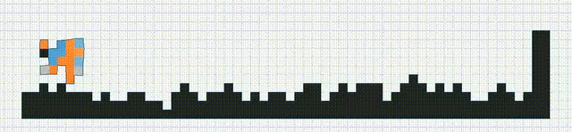

# Lamarckian Soft Robot

コントローラーの継承を経て進化したロボット (提案手法)


コントローラーの継承なしに進化したロボット (既存手法)


[English version of this README](./README.md)

## 概要
[Genetic and Evolutionary Computation Conference (GECCO-2024)](http://gecco-2024.sigevo.org/HomePage)に採択された論文「Lamarckian Co-design of Soft Robots via Transfer Learning」の実装のgithubレポジトリです。
深層強化学習による学習結果を個体間で共有することで、より効率の良いソフトロボットの設計を可能にしました。ロボットのシミュレーションには[evogym](https://evolutiongym.github.io/)を用いています。

## 環境構築

### evogymの環境構築
[evogymのgithubレポジトリ](https://github.com/EvolutionGym/evogym)のInstallationに従い、evogymを動かすための環境構築を行なってください。condaを用いた場合でしか検証を行っていないので、condaを用いる子をと推奨します。

### 本レポジトリのための環境構築
このレポジトリをローカルにcloneしてください。

その上でevogym環境に入ります。
```bash
conda activate evogym
```
本レポジトリに特有のモジュールを以下のようにインストールします。

```bash
conda install pydantic
```

## Pull Requestを出す場合
Pull Requestを出す場合は、フォーマッタ・リンターもインストールしてください:

```bash
conda install isort
conda install black
conda install mypy
```

フォーマッタ・リンターをかけてからPull Requestを出してください:
```bash
isort ./
balck ./
mypy ./
```

## チュートリアル
### まずは走らせてみる
以下のコードでロボットを進化させることができます（実行には数分かかる）。
```bash
python ./example/run.py --max-iters 10 --population-size 5 --max-evaluations 10 --exp-dir ./result/experiment
```
コマンドライン引数とその意味は[./alg.config.py](./alg/config.py)を参照してください。

### 中断された実験を再開する
アクシデント等により実験が途中で中断されてしまった場合、その実験結果を格納するディレクトリを指定することで実験を再開することができます。
```bash
python ./example/from_middle.py -e <再開する実験のディレクトリ>
```

### 条件を変えて実験を行う
初期世代の学習結果はそのままにして、コントローラーの継承の有無の条件を変更して実験を行いたい時があります。そのようなときには、まずすでに行った実験の初期世代を他の実験ディレクトリにコピーします:
```bash
python example/copy_first_generation.py -s ./result/experiment -d ./result/experiment_non_inherit -n
```
その上で、新たに誕生した実験ディレクトリの進化を再開します:
```bash
python ./example/from_middle.py --exp-dir ./result/experiment_non_inherit
```

### ロボットの可視化
実験結果を可視化することもできます。以下のコードでは、指定されたディレクトリに保存された実験で、最も成績の良いロボットの動きを可視化するコードです:
```bash
python visualize/best_robot.py -e ./result/experiment
```
ファイルのパスを指定すれば、ロボットの動きをmp4ファイルとして保存することもできます。
```bash
python visualize/best_robot.py -e ./result/experiment -m ./movie.mp4
```